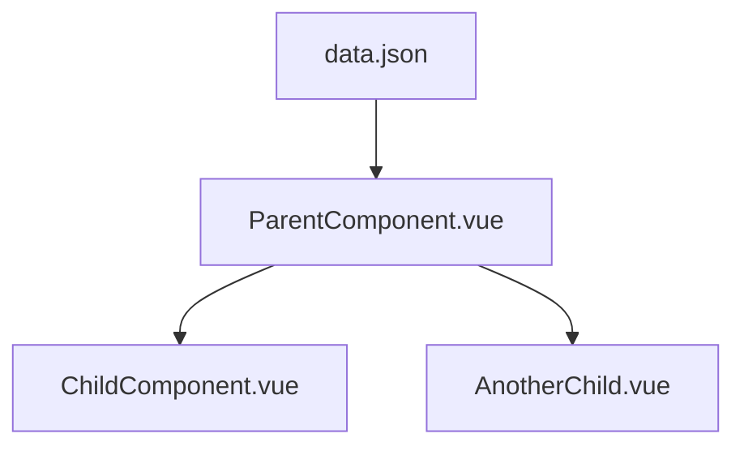

# Design

_Architecture, decisions, stack, diagram (mermaid)._

---

## Overview

<!-- High-level description of the feature's design approach. -->

## Component Architecture



<!-- Update the diagram to reflect actual components. -->

## Components

| Component | Responsibility |
|---|---|
| `ComponentName.vue` | <!-- What it does --> |

## Data Model

<!-- What data does this feature consume? Which JSON files? What shape? -->

```json
{
  "example": "schema here"
}
```

## Role-Aware Behavior

<!-- How does this feature change based on the active persona? -->

| Role | Behavior |
|---|---|
| Client | |
| Financial Advisor | |

## Design Decisions

| Decision | Rationale |
|---|---|
| <!-- e.g., Use Pinia for state --> | <!-- Why --> |

## Glassmorphism & Styling Notes

- Cards: semi-transparent background with `backdrop-filter: blur(14px)`
- Fonts: Quicksand for headlines, Open Sans for body
- Icons: Material Design Icons via Vuetify 3
- Status indicators: icon + color + label (never color alone)

## Responsive Behavior

| Breakpoint | Layout |
|---|---|
| Desktop (1200px+) | |
| Tablet (768px–1199px) | |
| Mobile (<768px) | |