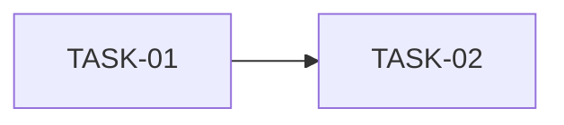

# Tasks

_List of implementation tasks with acceptance criteria._

---

## Task List

### TASK-01 — [Task Title]
**Status:** Not Started | In Progress | Complete  
**Priority:** High | Medium | Low  
**Estimated Effort:** S / M / L

**Description:**  
<!-- What needs to be built or changed? -->

**Acceptance Criteria:**
- [ ] Criterion 1
- [ ] Criterion 2
- [ ] Criterion 3

**Files to create/modify:**
- `src/components/ComponentName.vue`
- `src/data/dataFile.json`

---

### TASK-02 — [Task Title]
**Status:** Not Started  
**Priority:** Medium  
**Estimated Effort:** S

**Description:**  
<!-- What needs to be built or changed? -->

**Acceptance Criteria:**
- [ ] Criterion 1
- [ ] Criterion 2

**Files to create/modify:**
- `src/...`

---

## Task Dependencies

<!-- Show which tasks depend on others. -->

## Completion Checklist

- [ ] All tasks marked complete
- [ ] Acceptance criteria verified
- [ ] Responsive behavior tested (320px, 768px, 1200px+)
- [ ] Role switching tested
- [ ] No console errors