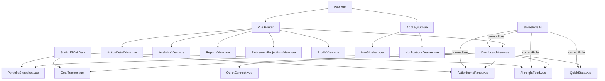

# System Patterns

_Common design and architecture patterns used in the project._

---

## Architecture Overview

Single-page application (SPA) built with Vue 3 + Vuetify 4, using a component-based architecture with role-aware rendering.

---

## Key Patterns

### Role-Based Rendering
- A role switcher (pill-style toggle) in DashboardView controls the active persona
- The active role is managed via a shared reactive store (`src/stores/role.ts`)
- Content panels import `currentRole` and conditionally render or filter data based on it
- Role switch updates all panels reactively without a full page reload

### Component Structure
- **Page-level views** in `src/views/` (DashboardView, ActionDetailView, AnalyticsView, ReportsView, RetirementProjectionsView, ProfileView)
- **Reusable widget components** in `src/components/`
- **Static mock data** in `src/data/` as JSON files
- Each component is self-contained with its own template, logic, and scoped styles

### Data Flow
- Mock data loaded from static JSON files (`portfolio.json`, `goals.json`, `actionItems.json`, `insights.json`)
- Data is filtered/transformed at the component level based on the active role
- Completed actions tracked in `src/stores/completedActions.ts`
- No backend API calls — all data is static

### Design System — Clean Card UI
- All cards use solid white backgrounds (#FFFFFF) with subtle box shadows
- Hover lift effect: `transform: translateY(-2px)` with shadow deepening
- Border radius: 16px on cards
- Background: light gray (#F5F6FA)
- No glassmorphism — clean, professional aesthetic

### Layout Pattern
- **Side navigation** — collapsible sidebar with icon + label nav items
- **Card grid** — two-column layout (content-left + content-right)
- **Notifications drawer** — slides out from sidebar
- **Responsive breakpoints:**
  - Desktop (1200px+): Full side nav + multi-column card grid
  - Tablet (768px-1199px): Collapsed side nav + 2-column grid
  - Mobile (<768px): Hamburger menu + single-column stacked cards

### Motion & Transitions
- Cards: subtle hover lift with shadow deepening
- Page transitions: Vue `<Transition>` component
- Notifications drawer: slide transition
- Role switcher: instant reactive update across all panels
