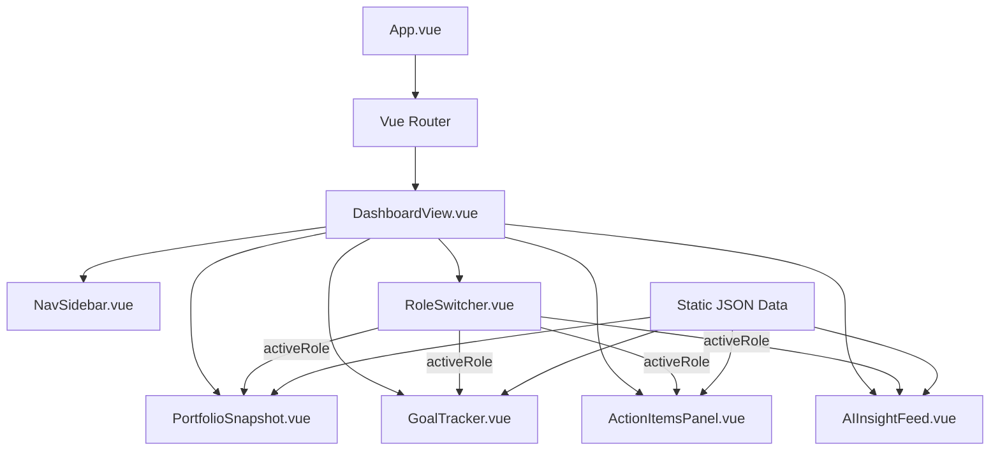

# System Patterns

_Common design and architecture patterns used in the project._

---

## Architecture Overview

Single-page application (SPA) built with Vue 3 + Vuetify 3, using a component-based architecture with role-aware rendering.

---

## Key Patterns

### Role-Based Rendering
- A top-level `RoleSwitcher` component controls the active persona
- The active role is passed via props or a shared store (Vuex/Pinia)
- All content panels conditionally render or filter data based on the active role
- Role switch updates all panels reactively without a full page reload

### Component Structure
- **Page-level views** in `src/views/` (e.g., `DashboardView.vue`)
- **Reusable widget components** in `src/components/`
- **Static mock data** in `src/data/` as JSON files
- Each component is self-contained with its own template, logic, and scoped styles

### Data Flow
- Mock data loaded from static JSON files (`portfolio.json`, `goals.json`, `actionItems.json`, `insights.json`)
- Data is filtered/transformed at the component level based on the active role
- No backend API calls in MVP — all data is static

### Design System — Glassmorphism
- All primary cards use semi-transparent backgrounds (`rgba` white) with `backdrop-filter: blur(12–16px)`
- Subtle inner border glow using light white/teal `rgba` border
- Abstract animated background (CSS keyframe gradient blobs) sits behind all content
- No card background is fully opaque

### Layout Pattern
- **Side navigation** — icon-first design, labels visible on expand/hover
- **Card grid** — generous padding and spacing between widget cards
- **Persistent AI Insight panel** anchored to the right side on desktop
- **Responsive breakpoints:**
  - Desktop (1200px+): Full side nav + multi-column card grid
  - Tablet (768px–1199px): Collapsed side nav + 2-column grid
  - Mobile (<768px): Bottom nav/hamburger + single-column stacked cards

### Motion & Transitions
- Background: slow CSS keyframe animation on gradient blobs (`animation: float 12s ease-in-out infinite`)
- Cards: subtle hover lift (`transform: translateY(-4px)`) with shadow deepening
- Page transitions: Vue `<Transition>` component
- Insight cards: fade + slide up on load and role switch